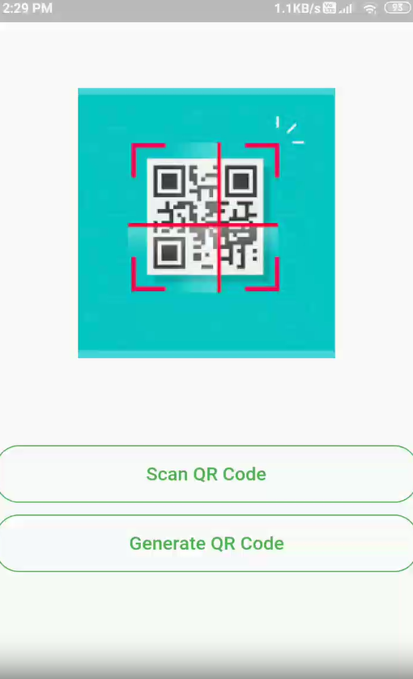
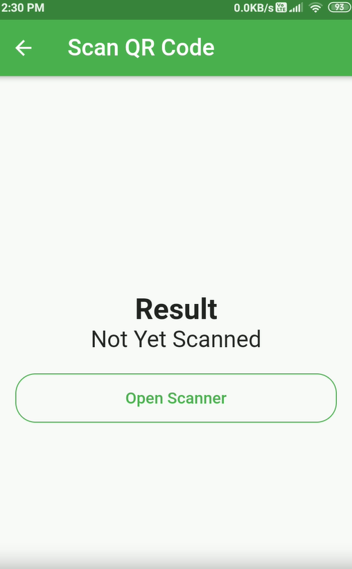
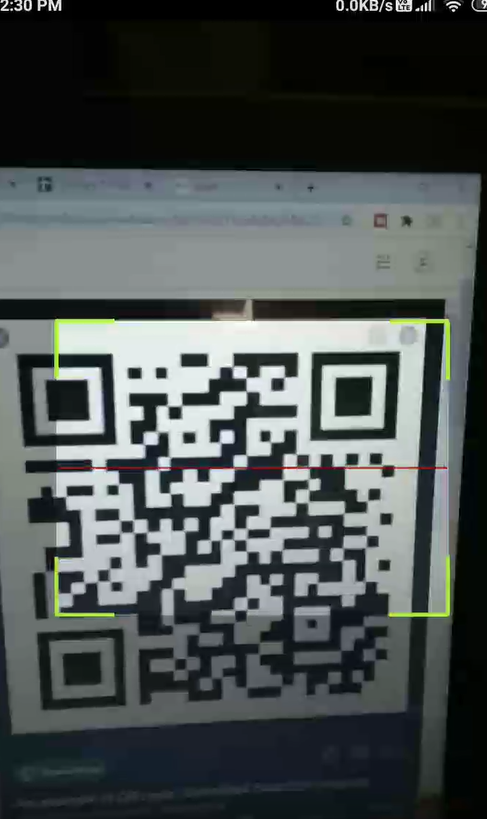
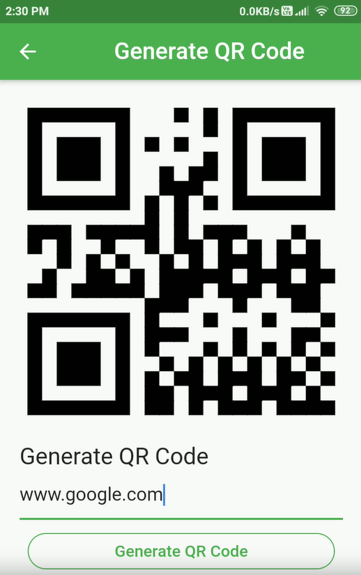

# QR Code Generator and Reader

## Overview
This is a simple Flutter application for generating and reading QR codes. It allows users to input text and convert it into a QR code, as well as scan and decode existing QR codes.

## Features
- **QR Code Generation:** Convert any text input into a QR code.
- **QR Code Scanning:** Scan QR codes to decode the embedded information.

## Technologies Used
- **Flutter**: UI framework for building mobile applications.
- **Dart**: Programming language used for Flutter development.

## App Screenshot

    
    
    
    

